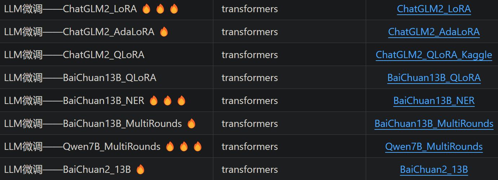
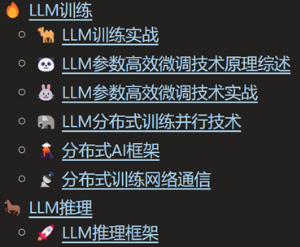
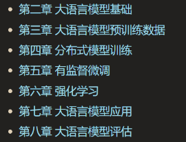

# 大模型实战落地-从理论到实践

## 简述

按个人偏好总结了学习目标与路径，后续将陆续整理相应学习资料，并输出学习笔记。

### 🎯学习目标
- 熟悉主流LLM（Llama, ChatGLM, Qwen）的技术架构和技术细节；有实际应用RAG、PEFT和SFT的项目经验
- 较强的NLP基础，熟悉BERT、GPT、Transformer、T5等预训练语言模型的实现，有对话系统相关研发经验
- 掌握TensorRT-LLM、vLLM等主流推理加速框架，熟悉模型量化、FlashAttention等推理加速技术方案，对分布式训练DeepSpeed框架有实战经验
- 熟悉Pytorch，具备扎实的深度学习和机器学习基础，基本掌握C/C++、Cuda和计算机系统原理

### 🚤参考项目
- **torchkeras** 
https://github.com/lyhue1991/torchkeras/

- **llm-action**
https://github.com/liguodongiot/llm-action

### 📕参考书籍
- **大规模语言模型：从理论到实践** 
https://intro-llm.github.io/intro-llm

- **ChatGPT原理与实战** https://github.com/liucongg/ChatGPTBook

### 📰参考课程
- 面向开发者的LLM入门课程（吴恩达课程-中文版）
https://github.com/datawhalechina/prompt-engineering-for-developers/blob/main/README.md

- **普林斯顿-COS 597G (Fall 2022): Understanding Large Language Models**
https://www.cs.princeton.edu/courses/archive/fall22/cos597G/

- **斯坦福-CS324 - Large Language Models**
https://stanford-cs324.github.io/winter2022/

### 🗒 教程
- Huggingface Transformers官方课程 https://huggingface.co/learn/nlp-course/
- Transformers快速入门（快速调包BERT系列）
https://transformers.run/

### 💥学习方式
- 力求快速应用 （先调包，再深入学习）
- 在实践中动手学习，力求搞懂每个关键点
- 【原理学习】+【代码实践】 + 【输出总结】

### 🔤基础知识
-  视频课程：
    - 吴恩达机器学习入门：https://www.coursera.org/learn/machine-learning
    - 李沐讲AI：https://space.bilibili.com/1567748478?spm_id_from=333.337.0.0
    - 台大李宏毅-机器学习 https://speech.ee.ntu.edu.tw/~hylee/ml/2023-spring.php 

    - 斯坦福NLP cs224n https://web.stanford.edu/class/cs224n/

-  书籍
    - 深度学习入门：基于Python的理论与实践：numpy实现MLP、卷积的训练
    -《深度学习进阶：自然语言处理》：numpy实现Transformers、word2vec、RNN的训练
    - Dive In Deep Learning(动手学深度学习) https://d2l.ai/
    - 《神经网络与深度学习》https://nndl.github.io/
    - 《机器学习方法》：李航的NLP相关的机器学习 + 深度学习知识（按需选学）

-  强化学习
    - 强化学习教程-蘑菇书EasyRL（李宏毅强化学习+强化学习纲要）https://datawhalechina.github.io/easy-rl/
    - 动手学强化学习 https://github.com/boyu-ai/Hands-on-RL/blob/main/README.md

### 🚩后续路径
**应用**：

**Zero Shot / Few Shot 快速开箱即用**
- Prompt调优:
    - 上下文学习In-Context Learning, ICL
    - 思维链 Chain of Thought, COT

- RAG (Retrieval Augmented Generation)
    - 基于文档分块、向量索引和LLM生成，如Langchain文档问答

**领域数据-指令微调LLM**

- PEFT (Parameter-Efficient Fine-Tuning):
    - LORA (Low-Rank Adaption of LLMs)
    - QLORA
    - SLORA
    - P-Tuning v2

    参数高效的微调，适合用于纠正模型输出格式（PEFT上限不高，并向LLM输入的知识有限）

- SFT (Supervised Fintuning):
    - 全参数监督微调，使用prompt指令样本全量微调LLM（可以注入新的领域知识）
    - 需要控制样本配比（领域数据 + 通用数据）

**对齐**

- 对齐人类偏好 (RLHF)：
    - RewardModel 奖励模型 （排序标注，判断答案价值）
    - RL (PPO， 更新SFT模型)

    专注基于强化学习的大语言模型对齐，有前景的方向是SuperhumanAI AutoALign

**预训练**
- 小模型预训练 (GPT2, TinyLlama) 

    不考虑训练参数规模较大的语言模型

**训练推理优化**： 
- 模型量化
- 推理加速
- 蒸馏
- 推理框架（vLLM、TensorRT-LLM、Llama.cpp）

# 学习目录

## 第1章 技术与需求分析
### 1.1 技术分析
#### 1.1.1 LLM的发展历程与趋势
#### 1.1.2 开源LLM生态
- **Llama系列**
- **Mistral / Mixtral-8X7B-MOE** ：https://mistral.ai/news/mixtral-of-experts/
- **ChatGLM / Baichuan**

### 1.2 市场需求分析
#### 1.2.1 需求和就业市场分析
- **预训练、对齐**
- **微调、应用**
- **推理加速**
#### 1.2.2、商业落地分析(2C、2B应用场景)

## 第2章 ChatGPT背景与原理
### 2.1 ChatGPT的背景知识
#### 2.1.1 ChatGPT发展趋势
#### 2.1.2 ChatGPT的能力
### 2.2　ChatGPT的工作原理
#### 2.2.1　预训练与提示学习阶段
#### 2.2.2　结果评价与奖励建模阶段
#### 2.2.3　强化学习与自我进化阶段
### 2.3 算法细节
#### 2.3.1　标注数据
#### 2.3.2　建模思路
#### 2.3.3　存在问题

## 第3章 预训练语言模型
### 3.1　Transformer
- 图解Transformer：http://jalammar.github.io/illustrated-transformer/
- 论文：《Attention Is All Your Need》
#### 3.1.1 Transformer结构
详解Transformer原理：https://www.cnblogs.com/justLittleStar/p/17322172.html
#### 3.1.2 Transformer实战
Torch代码详解和训练实战：https://www.cnblogs.com/justLittleStar/p/17786071.html

### 3.2　生成式预训练语言模型GPT
#### 3.2.1 GPT详解
**论文**
- GPT-1：Improving Language Understanding by Generative Pre-Training
- GPT-2: Language Models are Unsupervised Multitask Learners
- GPT-3：Language Models are Few-Shot Learners
- GPT-4：GPT-4 Technical Report(openai.com)

**博客**
- GPT2图解：http://jalammar.github.io/illustrated-gpt2/
- GPT2图解（中文）：https://www.cnblogs.com/zhongzhaoxie/p/13064404.html
- GPT3分析：[How GPT3 Works - Visualizations and Animations](http://jalammar.github.io/how-gpt3-works-visualizations-animations/ "How GPT3 Works - Visualizations and Animations")
- [GPT2模型源码阅读系列一GPT2LMHeadModel](https://blog.csdn.net/weixin_38224810/article/details/123492847 "GPT2模型源码阅读系列一GPT2LMHeadModel")

GPT原理分析：https://www.cnblogs.com/justLittleStar/p/17322259.html

#### 3.2.2 GPT实现
##### 3.2.2.1 动手用Numpy实现GPT
60行代码实现GPT,可加载GPT2 128M进行推理：https://www.cnblogs.com/justLittleStar/p/17925108.html

##### 3.2.2.3 动手用C++实现GPT
ToDo
参考：[CPP实现Transformer](https://github.com/dianhsu/transformer-cpp-cpu/tree/main "CPP实现Transformer")

#### 3.2.3 GPT训练和微调
##### 3.2.3.1 训练GPT2语言模型
- [基于Transformers库-Colab预训练GPT2](https://colab.research.google.com/github/huggingface/notebooks/blob/main/examples/language_modeling_from_scratch.ipynb#scrollTo=MOsHUjgdIrIW "Colab预训练GPT2")

- Transformers库GPT实现分析：ToDo

##### 3.2.3.2 GPT2微调-文本摘要实战
- **数据预处理模块**
- **GPT-2模型模块**
- **模型训练和推理模块**

##### 3.2.3.3 MiniGPT项目详解
双数加法：https://blog.csdn.net/wxc971231/article/details/132000182

##### 3.2.3.4 NanoGPT项目详解
- 代码分析：https://zhuanlan.zhihu.com/p/601044938
- 训练实战：莎士比亚数据训练

### 3.3 Mask语言模型
#### 3.3.1 BERT
**原理**
- BERT可视化：[A Visual Guide to Using BERT for the First Time](http://jalammar.github.io/a-visual-guide-to-using-bert-for-the-first-time/ "A Visual Guide to Using BERT for the First Time")
- BERT原理：https://www.cnblogs.com/justLittleStar/p/17322240.html

**实战**
- BERT结构和预训练代码实现：ToDo
- BERT预训练实战：[动手学深度学习-BERT预训练 Colab](https://colab.research.google.com/github/d2l-ai/d2l-pytorch-colab/blob/master/chapter_natural-language-processing-pretraining/bert-pretraining.ipynb#scrollTo=e17d97e2 "BERT预训练 Colab")
- 基于HuggingFace的BERT预训练
- BERT微调：文本分类、BERT-CRF NER、BERT+指针网络（UIE）信息抽取、文本摘要和相似性检索

#### 3.3.2 BERT衍生系列
- 	 RoBERTa
- 	 ALBERT / DistillBERT
- 	 SimBERT

### 3.4 其他
#### 3.4.1 T5系列
##### 3.4.1.2 T5-Pegasus对话摘要微调
##### 3.4.1.3 PromptClue关键词抽取微调
#### 3.4.2 UniLM
##### 3.4.2.1 UniLM模型介绍
##### 3.4.2.2 基于夸夸闲聊数据的UniLM模型实战
- 数据预处理
- UniLM模型
- 模型训练与推理

## 第4章　提示学习与大型语言模型
### 4.1　提示学习PromptLearning
#### 4.1.1　提示学习介绍
#### 4.1.2　提示模板设计
#### 4.1.3　答案空间映射设计
### 4.2　上下文学习
#### 4.2.1　上下文学习介绍
#### 4.2.2　预训练阶段提升上下文
#### 4.2.3　推理阶段优化上下文
### 4.3 指令数据构建
#### 4.3.1 手动和自动构建指令 
#### 4.3.2 开源指令数据集
#### 4.3.3 基于提示的文本情感分析实战
https://github.com/liucongg/ChatGPTBook/tree/main/PromptProj
- 数据预处理
- 模型结构与训练模块

## 第5章 开源大型语言模型
### 5.1 Mistral
**Mistral 7B Tutorial:** https://www.datacamp.com/tutorial/mistral-7b-tutorial
#### 5.1.1 Mistral的模型结构
#### 5.1.3 Mistral 源码解析
#### 5.1.4 Mistral-6B微调

### 5.2 Llama源码
#### 5.2.1 Llama1
**Llama1源码深入解析:** https://zhuanlan.zhihu.com/p/648365207

#### 5.2.2 Llama2
- Llama2的优化
- Llama2源码解析

llama 2详解： https://zhuanlan.zhihu.com/p/649756898

- Llama2-6B微调
### 5.3 ChatGLM
#### 5.2.1 ChatGLM简介
#### 5.2.2 ChatGLM-6B微调
**ChatGLM2微调保姆级教程:** https://zhuanlan.zhihu.com/p/643856076

### 5.4 CodeLlama
#### 5.2.1 CodeLlama简介
#### 5.2.2 CodeLlama微调

## 第6章 LLM微调
### 6.1 全量指令微调
### 6.2 高效模型微调PEFT简介
### 6.3 LORA系列
#### 6.3.1 LoRA（Low Rank Adapter）
**ChatGLM-6B**: https://zhuanlan.zhihu.com/p/625468667
**ChatGLM2微调保姆级教程**:https://zhuanlan.zhihu.com/p/643856076

#### 6.3.2 QLoRA
用bitsandbytes、4比特量化和QLoRA打造亲民的LLM:https://www.cnblogs.com/huggingface/p/17816374.html

#### 6.3.3 AdaLoRa
#### 6.3.4 SLoRA
### 6.4 P-Tuning系列
#### 6.4.1 P-Tuning V1
#### 6.4.2 P-Tuning V2
### 6.5 基于LLM微调的信息抽取实战
#### 6.5.1 ChatGLM项目简介
#### 6.5.2 数据预处理模块
#### 6.5.3 Freeze微调模块
#### 6.5.4 LoRA微调模块
#### 6.5.5 P-Tuning v2微调模块
### 6.6 Deepspeed-Chat SFT 实践 
#### 6.6.1 代码结构
#### 6.6.2 数据预处理
#### 6.6.3 自定义模型 
#### 6.6.4 模型训练
#### 6.6.5 模型推理

## 第7章 大型语言模型预训练
### 7.1 大型预训练模型简介
### 7.2 预训练模型中的分词器
#### 7.2.1 BPE详解
#### 7.2.2 WordPiece
#### 7.2.3 Unigram
#### 7.2.4 SentencePiece详解
### 7.3 分布式训练
#### 7.3.1 分布式训练概述
#### 7.3.2 分布式训练并行策略
#### 7.3.3 分布式训练的集群架构
#### 7.3.4 分布式深度学习框架
##### 7.3.4.1 Megatron-LM详解
##### 7.3.4.2 DeepSpeed详解
##### 7.3.4.3 Colossal-AI
### 7.4 基于DeepSpeed的LLM预训练实战
#### 7.4.1 GLM项目简介
#### 7.4.2 数据预处理模块
#### 7.4.3 执行模型训练
### 7.5 DeepSpeed实践
#### 7.5.1 基础概念
#### 7.5.2 LLaMA 分布式训练实践
### 7.6 MOE
#### 7.6.1 基础概念
#### 7.6.2 Mixstral-8X7B-MOE-介绍 

## 第8章 LLM应用
### 8.1 推理规划
#### 8.1.1 思维链提示（Chain-of-Thought Prompting）
#### 8.1.2 由少至多提示（Least-to-Most Prompting）
### 8.2 综合应用框架
#### 8.2.1 LangChain框架核心模块
**9个范例带你入门langchain:** https://zhuanlan.zhihu.com/p/654052645
#### 8.2.2 知识库问答实践
### 8.3 智能代理AI Agent
LLM Powered Autonomous Agents: https://lilianweng.github.io/posts/2023-06-23-agent/

#### 8.3.1 智能代理的组成
#### 8.3.2 智能代理的应用实例 

## 第9章 LLM加速
### 9.1 注意力优化
#### 9.1.1 FlashAttention系列
#### 9.1.2 PagedAttention
深入理解 BigBird 的块稀疏注意力: https://www.cnblogs.com/huggingface/p/17852870.html
https://hf.co/blog/big-bird

### 9.2 CPU推理加速
#### 9.2.1 Llama.c应用与代码详解
#### 9.2.2 Llama.cpp应用与代码详解
#### 9.2.3 ChatGLM.cpp应用与代码详解
### 9.3 推理优化框架
#### 9.3.1 TensorRT-LLM应用与代码详解
#### 9.3.2 vLLM推理框架实践
### 9.4 训练加速

## 第10章 强化学习
### 10.1 基础
#### 10.1.1 强化学习概述
#### 10.1.2 强化学习与有监督学习的区别 
### 10.2 强化学习环境
### 10.3 强化学习算法
#### 10.3.1 Q-learning算法
#### 10.3.2 SARSA算法
#### 10.3.3 DQN算法
#### 10.3.4 Policy Gradient算法
#### 10.3.5 Actor-Critic算法

## 第11章 PPO算法与RLHF理论实战
### 11.1 近端策略优化算法PPO简介
 PPO：Proximal Policy Optimization Algorithms.
#### 11.1.1 策略梯度算法回顾
#### 11.1.2 广义优势估计 
#### 11.1.3 PPO算法原理剖析
#### 11.1.4 PPO算法对比与评价
**使用PPO算法进行RLHF的N步实现细节**: https://www.cnblogs.com/huggingface/p/17836295.html

### 11.2 基于人类反馈的强化学习RLHF框架
RLHF：Augmenting Reinforcement Learning with Human Feedback
#### 11.2.1 RLHF的流程
#### 11.2.2 RLHF内部剖析
#### 11.2.3 RLHF价值分析
#### 11.2.4 RLHF问题分析
#### 11.2.5 数据收集与模型训练
#### 11.2.6 开源数据

RLHF实践
https://zhuanlan.zhihu.com/p/635569455

详解大模型RLHF过程（配代码解读）
https://zhuanlan.zhihu.com/p/624589622

### 11.3　InstructGPT模型分析
InstructGPT：Training language models to follow instructions with human feedback
#### 11.3.1 模型简介
#### 11.3.2 数据收集
#### 11.3.3 模型原理
#### 11.3.4 模型讨论

### 11.4 基于PPO的正向情感倾向性
https://github.com/liucongg/ChatGPTBook/tree/main/PPOProj
#### 11.4.1 项目任务与数据集分析
#### 11.4.2 数据预处理模块
#### 11.4.3 模型训练模块
#### 11.4.4 模型生成模块
#### 11.4.5 模型评估模块
### 11.5 MOSS-RLHF 实践
#### 11.5.1 奖励模型训练
#### 11.5.2 PPO 微调

## 第12章 类ChatGPT实战
### 12.1 任务设计
### 12.2 数据准备
### 12.3 基于文档生成问题任务的类
#### 12.3.1 SFT阶段
#### 12.3.2 RM阶段
#### 12.3.3 RL阶段
https://github.com/liucongg/ChatGPTBook/tree/main/RLHFProj

## 第13章 语言模型训练数据
### 13.1 数据来源
#### 13.1.1 通用数据
#### 13.1.2 专业数据
### 13.2 数据处理 
#### 13.2.1 低质过滤
#### 13.2.2 冗余去除
#### 13.2.3 隐私消除
#### 13.2.4 词元切分
### 13.3 数据影响分析 
#### 13.3.1 数据规模影响
#### 13.3.2 数据质量影响 
#### 13.3.3 数据多样性影响
### 13.4 开源数据集合
#### 13.4.1 Pile
#### 13.4.2 ROOTS
#### 13.4.3 RefinedWeb 
#### 13.4.4 SlimPajama

## 第14章 大语言模型评估 
### 14.1 模型评估概述
### 14.2 大语言模型评估体系
#### 14.2.1 知识与能力
#### 14.2.2 伦理与安全 
#### 14.2.3 垂直领域评估
### 14.3 大语言模型评估方法 
#### 14.3.1 评估指标
#### 14.3.2 评估方法
### 14.4 大语言模型评估实践 
#### 14.4.1 基础模型评估
#### 14.4.2 SFT/RL 模型评估 

## 第15章 多模态大模型
### 15.1 多模态大模型调研
### 15.1 实战

## 第16章 大模型原生应用
### 16.1 落地调研
#### 16.1.1 应用分析
- 提供接口服务：
ChatGPT、Gemini、文心一言和GLM4等，主要面向ToC/ToB提供chat能力（内容创作、代码开发等），通过会员收费或按Token计费。

- ToB提供成套解决方案

- 集成现有接口二次开发，应用开发

- 开源模型增量预训练、全量微调、高效微调，行业内落地

模型最终还需落地解决实际问题，创造价值：优化现有问题、满足、甚至创造用户需求。

总的来说，就是规模化、自动化人的工作，替代人工，批量化、大规模生成或提供服务。

## 一些思考

在企业里面做7B、13B量级的微调，主要就是在搞数据、样本，技术壁垒不高。预训练壁垒高，因为需要烧钱堆经验。

在这个日新月异的时代，如何紧跟行业主流发展，并具备不可替代性是个难题：
- 稀缺（不可替代性）
- 稳定（业务和表层技术天天变，但底层的理论变化不大）
- 需求持续（最好是类似衣食住行的刚需，否则技术 过时/热度褪去/不达预期，泡沫崩溃）
- 不能越老越吃香（放到绝大多数行业都适用：不能经验积累，持续长期创造价值）
- 壁垒（技术、业务、资本上有垄断）

尽量往底层和工程化上靠，学习相对不变的技术（理论上变化很难），迁移到稳定或有前景的行业：
- 计算机系统知识（训练、推理、开发，模型推理部署工程化）
- 数学（深入学习并实践）
- 经济学 / 心理学
