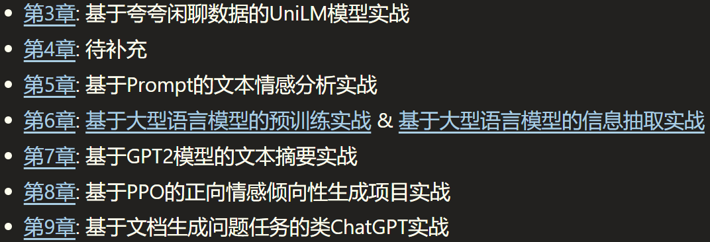

# 大模型实战落地-从理论到实践

按个人偏好总结了学习目标与路径，后续将陆续整理相应学习资料，并输出学习笔记。
建议先从主流的Qwen2、Llama3.1上手，先快速体验提示词工程，然后再学习LLM模型架构，尝试RAG，跑LoRA微调脚本。

进一步的学习目标：
- 学习如何从零训练大模型（1B左右规模，预训练+SFT+DPO），打通整个流程。

- 钻研SFT：  
  - 专有任务如Code生成、NL2SQL或通用NLP的NER、分类、抽取、摘要模型
  - 场景领域微调，金融任务LLM、法律LLM、医学LLM、电商LLM

- Llama系列\Gemma系列中文增量预训练：先做Llama3.1, 等待Llama4，期望Llama5

- RAG落地：搭建领域问答机器人、知识问答助手

大模型学习的思路有两个：
- 学习见效最快，投入产出比最大的  -> 快速上手之后，能立即带来产出收益（譬如调包微调）
- 学习底层基础，越靠近第一性原理越好 -> 底层变得慢，短期无收益但长期看好（譬如优化器）

但这么多内容，不可能什么都学，一定得排一个优先级，立一个目标来学习，实践和理论相结合，不然四处为战，很快就懈怠了。
如果要深入学习，建议按以下步骤（提供了详细的学习资料和路径），按需学习：

## 一、简述
按个人偏好总结了学习目标与路径，后续将陆续整理相应学习资料，并输出学习笔记。
学习思路： 快速应用Transformers库等轮子来使用、微调和对齐LLM，同时深入学习NLP预训练模型原理和推理部署（因为偏底层的东西变化不大）

### 学习目标
- 熟悉主流LLM（Llama, Qwen）的技术架构和细节；熟悉LLM训练流程，有实际应用RAG、PEFT和SFT的项目经验；
- 较强的NLP基础，熟悉GPT、BERT、Transformer练语言模型的实现，有对话系统、搜索相关研发经验；
- 掌握分布式训练DeepSpeed框架使用，有百亿模型预训练或SFT经验；熟悉vLLM理加速框架，模型量化、FlashAttention等推理加速技术方案，
- 熟悉Pytorch，具备扎实的深度学习和机器学习基础，有Liunx下Python、Git开发经验，了解计算机系统原理

注意，不同岗位的学习目标，需求不同。
- 大模型初创或大厂自研大模型岗，具体有预训练组、后训练组（微调、强化学习对齐）、评测组、数据组、Infra优化组，但偏难。
- 大模型应用算法
  - 搜广推场景
  - 降本增效
  - 助手

### 🎯学习目标
- 熟悉主流LLM（Llama, ChatGLM, Qwen）的技术架构和技术细节；有实际应用RAG、PEFT和SFT的项目经验
- 较强的NLP基础，熟悉BERT、GPT、Transformer等预训练语言模型的实现，有对话系统相关研发经验
- 掌握TensorRT-LLM、vLLM等主流推理加速框架，熟悉模型量化、FlashAttention等推理加速技术方案，对分布式训练DeepSpeed框架有实战经验
- 熟悉Pytorch，具备扎实的深度学习和机器学习基础，基本掌握C/C++、Cuda和计算机系统原理

### 🚤参考项目

- **手把手教学从头build LLM**
https://link.zhihu.com/?target=https%3A//github.com/rasbt/LLMs-from-scratch

Build a Large Language Model (From Scratch)

- **LlamaFactory: 一键式LoRA微调、全参SFT、增量预训练框架**
易用便捷，整合了很多微调算法，支持主流开源模型（封装地太厉害）
https://zhuanlan.zhihu.com/p/697773502

- **大牛Karpathy的Github**
从基础的makemore、minbpe, 到NanaGPT、llm.c等，都是学习LLM的非常好的项目。

​github.com/karpathy/
他的LLM101c教程，虽然还在制作中，但是主要内容还是他之前的Github项目。

- **torchkeras** 
https://github.com/lyhue1991/torchkeras/

- **llm-action**
https://github.com/liguodongiot/llm-action

### 📕参考书籍
- **大规模语言模型：从理论到实践** 
https://intro-llm.github.io/intro-llm

- **ChatGPT原理与实战** https://github.com/liucongg/ChatGPTBook

### 📰参考课程
- 面向开发者的LLM入门课程（吴恩达课程-中文版）
https://github.com/datawhalechina/prompt-engineering-for-developers/blob/main/README.md

- **普林斯顿-COS 597G (Fall 2022): Understanding Large Language Models**
https://www.cs.princeton.edu/courses/archive/fall22/cos597G/

- **斯坦福-CS324 - Large Language Models**
https://stanford-cs324.github.io/winter2022/

### 🗒 教程
- Huggingface Transformers官方课程 https://huggingface.co/learn/nlp-course/
- Transformers快速入门（快速调包BERT系列）
https://transformers.run/
- 基于transformers的自然语言处理(NLP)入门: https://github.com/datawhalechina/learn-nlp-with-transformers/tree/main

### 💥学习方式
- 力求快速应用 （先调包，再深入学习）
- 在实践中动手学习，力求搞懂每个关键点
- 【原理学习】+【代码实践】 + 【输出总结】

### 🔤基础知识
-  视频课程：
    - 吴恩达机器学习入门：https://www.coursera.org/learn/machine-learning
    - 李沐讲AI：https://space.bilibili.com/1567748478?spm_id_from=333.337.0.0
    - 台大李宏毅-机器学习 https://speech.ee.ntu.edu.tw/~hylee/ml/2023-spring.php 
    - 斯坦福NLP cs224n https://web.stanford.edu/class/cs224n/

-  书籍
    - 深度学习入门：基于Python的理论与实践：numpy实现MLP、卷积的训练
    -《深度学习进阶：自然语言处理》：numpy实现Transformers、word2vec、RNN的训练
    - Dive In Deep Learning(动手学深度学习) https://d2l.ai/
    - 《神经网络与深度学习》https://nndl.github.io/
    - 《机器学习方法》：李航的NLP相关的机器学习 + 深度学习知识（按需选学）

-  强化学习
    - 强化学习教程-蘑菇书EasyRL（李宏毅强化学习+强化学习纲要）https://datawhalechina.github.io/easy-rl/
    - 动手学强化学习 https://github.com/boyu-ai/Hands-on-RL/blob/main/README.md
      
- 数学基础
    推荐这本非常实用的开源数学书：《爱丽丝梦游可微仙境》
    ​www.sscardapane.it/alice-book/?s=09

### 🚩后续路径
**应用**：

**Zero Shot / Few Shot 快速开箱即用**
- Prompt调优:
    - 上下文学习In-Context Learning, ICL
    - 思维链 Chain of Thought, COT
    - Costar提示词模板：云端听茗：提示工程综合指南：揭示COSTAR框架的力量提示工程综合指南：揭示COSTAR框架的力量
    - Kimi的提示词应用: 自动出提示词，基本是按Costar模板
- RAG (Retrieval Augmented Generation)
    - 基于文档分块、向量索引和LLM生成，如Langchain文档问答
    - https://link.zhihu.com/?target=https%3A//www.kaggle.com/code/leonyiyi/chinesechatbot-rag-with-qwen2-7b

**领域数据-指令微调LLM**

- PEFT (Parameter-Efficient Fine-Tuning):
    - LORA (Low-Rank Adaption of LLMs)
    - QLORA
    参数高效的微调，适合用于纠正模型输出格式（PEFT上限不高，并向LLM输入的知识有限）
    一般就是尝试LoRA，不然就是全参SFT, LoRA变体尝试地比较少（边际效应不高）
     
- SFT (Supervised Fintuning):
    - 全参数监督微调，使用prompt指令样本全量微调LLM（可以注入新的领域知识）
    - 需要控制样本配比（领域数据 + 通用数据）

**对齐**

- 对齐人类偏好 (RLHF)：
    - RewardModel 奖励模型 （排序标注，判断答案价值）
    - RL (PPO、DPO， 更新SFT模型)
    专注基于强化学习的大语言模型对齐

**预训练**
- 小模型预训练 (NanoGPT, TinyLlama) 
    不考虑训练参数规模较大的语言模型

**训练推理优化**： 
- 模型量化
- 推理加速
- 蒸馏
- 推理框架（vLLM、TensorRT-LLM、Llama.cpp）

# 学习目录
## 第1章 技术报告
### 1.1 技术分析
开源大模型技术报告
- Llama技术报告：The Llama 3 Herd of Models - arXiv.org
- Mixtral-8X7B-MOE ：https://mistral.ai/news/mixtral-of-experts
- Qwen技术报告：Qwen Technical Report Qwen1比Qwen2的报告细节多
- 70B模型训练细节：https://imbue.com/research/70b-intro/

端侧大模型技术报告:
-面壁智能的详尽技术报告：MiniCPM: Unveiling the Potential of Small Language Models with Scalable Training Strategies
- 苹果AFM: Introducing Apple’s On-Device and Server Foundation Models
- Meta团队端侧尝试：MobileLLM: Optimizing Sub-billion Parameter Language Models for On-Device Use CasesLL

## 第2章 ChatGPT背景与原理
### 2.1 ChatGPT的工作原理
- 预训练与提示学习阶段
- 结果评价与奖励建模阶段
- 强化学习阶段
### 2.2 算法细节
- 标注数据
- 建模思路
- 
## 第3章 预训练语言模型
### 3.1 Transformer
**论文**
《Attention Is All Your Need》
**解析**:
图解Transformer：http://jalammar.github.io/illustrated-transformer/
**实战**
Transformer代码详解和训练实战：LeonYi：长文详解Transformer PyTorch预训练实现

### 3.2 GPT
GPT论文
- GPT-1：Improving Language Understanding by Generative Pre-Training
- GPT-2: Language Models are Unsupervised Multitask Learners
- GPT-3：Language Models are Few-Shot Learners
- GPT-4：GPT-4 Technical Report(http://openai.com)

解析
- GPT2图解：http://jalammar.github.io/illustrated-gpt2/
- GPT2图解（中文）：https://www.cnblogs.com/zhongzhaoxie/p/13064404.html
- GPT3分析：How GPT3 Works - Visualizations and Animations
- GPT原理分析：https://www.cnblogs.com/justLittleStar/p/17322259.html

推理
- GPT2模型源码阅读系列一GPT2LMHeadModel
- 60行代码实现GPT推理（PicoGPT）：LeonYi：多图详解LLM原理-60行numpy实现GPT
- 动手用C++实现GPT：ToDo, 参考：CPP实现Transformer

训练
- 训练GPT2语言模型：基于Transformers库-Colab预训练GPT2
- MiniGPT项目详解-实现双数加法：https://blog.csdn.net/wxc971231/article/details/132000182
- NanoGPT项目详解
  - 代码分析：https://zhuanlan.zhihu.com/p/601044938
  - 训练实战：LeonYi：【LLM训练系列】NanoGPT源码详解及其中文GPT训练实践
- 微调-文本摘要实战
  - LeonYi：大模型实战-微软Phi2对话摘要QLoRA微调

### 3.3 BERT
原理
- BERT可视化：A Visual Guide to Using BERT for the First Time
- BERT原理：https://www.cnblogs.com/justLittleStar/p/17322240.html
实战
- BERT结构和预训练代码实现：ToDo
- BERT预训练实战：LeonYi：基于Transformers库预训练自己的BERT
- BERT微调：
  - 文本分类
  - 抽取：BERT-CRF NER / BERT+指针网络（UIE）信息抽取
  - 相似性检索: SimCSE-BERT / BGE/ ColBERT
- 衍生系列
  RoBERTa / DeBERTa/

## 第4章 提示学习与大型语言模型
### 4.1 提示学习PromptLearning

提示学习介绍
答案空间映射设计： LLM时代就是做个标签映
上下文学习ContextLearning介绍

### 4.2 指令数据构建
- 手动和自动构建指令: 基于GPT4或top大模型 抽取，再人工校正
- 开源指令数据集：alphaz

## 第5章 开源大型语言模型
### 5.1 Llama
Llama1
- Llama1源码深入解析: https://zhuanlan.zhihu.com/p/648365207
Llama2
- llama 2详解： https://zhuanlan.zhihu.com/p/649756898
Llama3: notebook一层层详解实现
- ​github.com/naklecha/llama3-from-scratch

## 5.2 Qwen
Qwen2: https://qwenlm.github.io/zh/blog/qwen2/

## 第6章 LLM微调
### 6.1 全量微调SFT
使用SFT-Trainer或Llama-Factory实现
重要的是数据准备和数据配比

### 6.2 高效微调PEFT
LoRA（Low Rank Adapter）

LoRA原理：大模型高效微调-LoRA原理详解和训练过程深入分析
https://zhuanlan.zhihu.com/p/702629428

大模型PEFT综述详解-从Adpter、PrefixTuning到LoRA
https://zhuanlan.zhihu.com/p/696057719

ChatGLM2微调保姆级教程: https://zhuanlan.zhihu.com/p/643856076

QLoRA
用bitsandbytes、4比特量化和QLoRA打造亲民的LLM:https://www.cnblogs.com/huggingface/p/17816374.html

## 第7章 大型语言模型预训练
### 7.1 预训练模型中的分词器
- BPE详解
- WordPiece详解
- SentencePiece详解

MinBPE实战和分析：https://github.com/karpathy/minbpe

### 7.2 分布式训练
- 分布式训练概述
- 分布式训练并行策略
- 分布式训练的集群架构
- 分布式深度学习框架
-Megatron-LM详解
- DeepSpeed详解
实践
- 基于DeepSpeed的Qwen预训练实战
- 基于DeepSpeed的Qwen LoRA和SFT训练实践

## 第8章 LLM应用
### 8.1 推理规划
思维链提示（Chain-of-Thought Prompting）
6 chain of thought template: Zeroshot / Fewshot/ Step-Back ..

### 8.2 综合应用框架
- LangChain框架核心模块
9个范例带你入门langchain:https://zhuanlan.zhihu.com/p/654052645
- LlamaIndex
https://qwen.readthedocs.io/en/latest/framework/LlamaIndex.html

### 8.3 智能代理AI Agent
智能代理介绍
LLM Powered Autonomous Agents: https://lilianweng.github.io/posts/2023-06-23-agent/

## 第9章 LLM加速
### 9.1 注意力优化
FlashAttention系列
PagedAttention
深入理解 BigBird 的块稀疏注意力: https://www.cnblogs.com/huggingface/p/17852870.htmlhttps://hf.co/blog/big-bird

### 9.2 推理优化框架
vLLM推理框架实践

### 9.3 训练加速
unsloth

## 第10章 强化学习
### 10.1 强化学习算法
- Q-learning算法
- DQN算法
- Policy Gradient算法
- Actor-Critic算法

##  第11章 PPO算法与RLHF理论实战
### 11.1 近端策略优化算法PPO
PPO：Proximal Policy Optimization Algorithms 论文
PPO介绍
- 广义优势估计
- PPO算法原理剖析
- PPO算法对比与评价
使用PPO算法进行RLHF的N步实现细节: https://www.cnblogs.com/huggingface/p/17836295.html

PPO实战
- 基于PPO的正向情感倾向性 https://github.com/liucongg/ChatGPTBook/tree/main/PPOProj
-  
###  11.2 基于人类反馈的强化学习RLHF

InstructGPT模型分析
- InstructGPT：Training language models to follow instructions with human feedback
- 论文RLHF：Augmenting Reinforcement Learning with Human Feedback

RLHF内部剖析
- 详解大模型RLHF过程（配代码解读） https://zhuanlan.zhihu.com/p/624589622

- RLHF价值分析
- RLHF问题分析
- 数据收集与模型训练
- 模型训练\生成\评估
https://zhuanlan.zhihu.com/p/635569455

RLHF 实践
- OpenRLHF

## 第12章 类ChatGPT实战
【LLM训练系列】从零开始训练大模型之Phi2-mini-Chinese项目解读
https://zhuanlan.zhihu.com/p/718307193

## 第13 章 多模态大模型
多模态大模型调研
Qwen2-VL-7B 实战
Qwen2-VL-7B 微调

## 一些思考

在企业里面做7B、13B量级的微调，主要就是在搞数据、样本，技术壁垒不高。预训练壁垒高，因为需要烧钱堆经验。

在这个日新月异的时代，如何紧跟行业主流发展，并具备不可替代性是个难题：
- 稀缺（不可替代性）
- 稳定（业务和表层技术天天变，但底层的理论变化不大）
- 需求持续（最好是类似衣食住行的刚需，否则技术 过时/热度褪去/不达预期，泡沫崩溃）
- 不能越老越吃香（放到绝大多数行业都适用：不能经验积累，持续长期创造价值）
- 壁垒（技术、业务、资本上有垄断）

尽量往底层和工程化上靠，学习相对不变的技术（理论上变化很难），迁移到稳定或有前景的行业：
- 计算机系统知识（训练、推理、开发，模型推理部署工程化）
- 数学（深入学习并实践）
- 经济学 / 心理学
